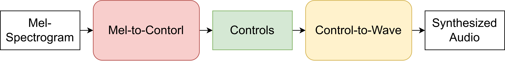

# DDSP Vocoders

## A. Meet Our Vocoders


All the vocoders we presented are **'harmonic plus noise'** models[4]. According to their harmonic synthesizers, we have the following models:

|  Model Name  | Harmonic Synthesizer |   Note              |
|:------------:|:--------------------:|:-------------------:|
| SawSinSub    | Filtered Sawtooth Oscaillator </br> Approximated Bank of Sinusoidal Oscaillators | proposed SawSing[1]|
| Sins         | Bank of Sinusoidal Oscaillators          | [2] |
| DWS          | Wavetable Synthesizer                    | [3]               |
| Full         | Filtered Bank of Sinusoidal Oscaillators | modified from [2] |
| SawSub       | Filtered Sawtooth Oscaillator            | ---               |

In our paper, we only compare and report 3 vocoders: Sins (DDSP-Add), DWS (DWTS), SawSinSub (SawSing). 

To try different vocoders, please modify the `--model` argument when entering commands. Note that depending on the vocoders, their configuration are slightly different.

```
python main.py --config <path-to-config> \
               --stage  training \
               --model <model-name>
```

If you would like to know more about impelementation details of syntehsizers, please refet to [synthesizer_design](./synthesizer_design.md).

## B. Future Work
1. Mel2Ctrl
2. Can we use f0 from AM?
3. LTV-FIR filter
4. Sourece: f0,  trainable blending source?
5. Trasient Modeling

---
## C. References
[1] (ISMIR'22)[SawSing: A DDSP-based Singing Vocoder via Subtractive Sawtooth Waveform Synthesis](./ismir_22_sawsing.pdf)  
[2] (ICLR'20) [DDSP: Differentiable Digital Signal Processing](https://openreview.net/forum?id=B1x1ma4tDr)  
[3] (ICASSP'22)[Differentiable Wavetable Synthesis](https://arxiv.org/abs/2111.10003)  
[4] (ICASSP'93) [HNS: Speech modification based on a harmonic+noise model](https://ieeexplore.ieee.org/document/319365)  